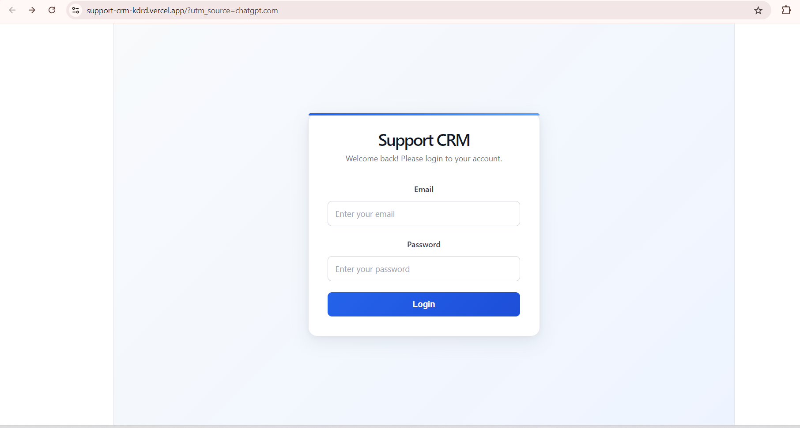
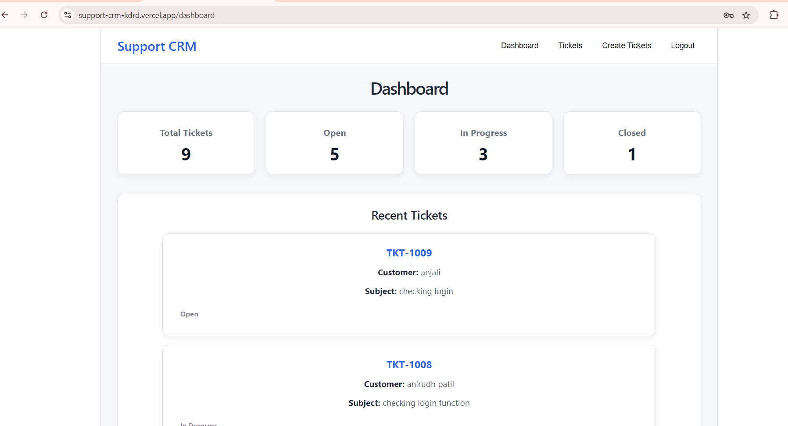
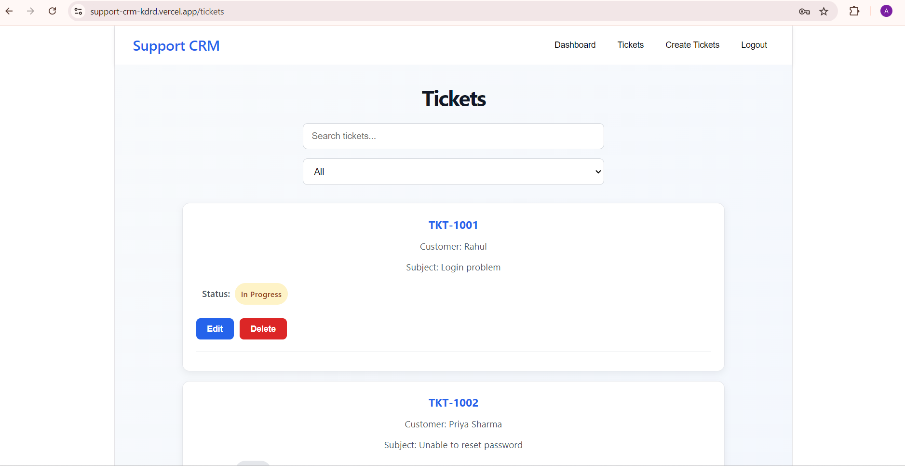
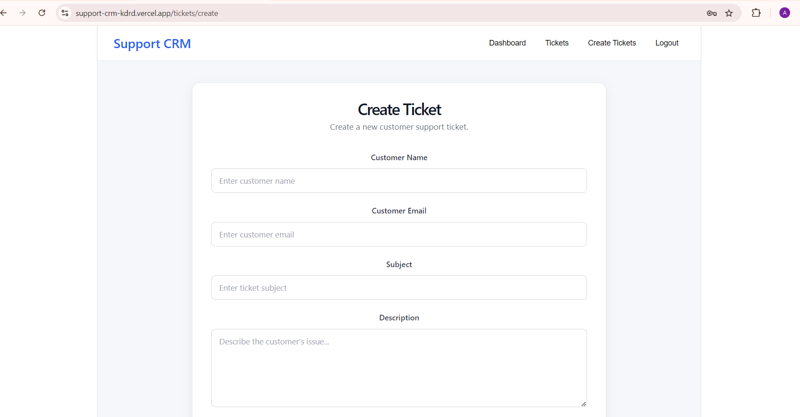

# 🎫 Support CRM

A full-stack Customer Support CRM application built using the MERN stack.

Support CRM allows support teams to create, manage, search, filter, update, and delete customer support tickets from a simple and responsive dashboard.

## 🚀 Live Demo

### Frontend
https://support-crm-kdrd.vercel.app

### Backend API
https://support-crm-qohj.onrender.com

---

## 📌 Features

- 🔐 User authentication
- 🛡️ Protected API routes using JWT
- 🎫 Create support tickets
- 📋 View all support tickets
- 🔎 Search tickets by customer name or subject
- 🔽 Filter tickets by status
- ✏️ Update tickets
- 🗑️ Delete tickets
- 📊 Dashboard with ticket statistics
- 📈 Total ticket count
- 🟢 Open ticket count
- 🟡 In Progress ticket count
- ⚪ Closed ticket count
- 📱 Responsive design
- 🌐 REST API
- ☁️ Deployed frontend and backend

---

## 🛠️ Tech Stack

### Frontend

- React
- React Router
- Axios
- CSS
- Vite

### Backend

- Node.js
- Express.js
- MongoDB
- Mongoose
- JWT
- bcryptjs
- CORS

### Deployment

- Vercel — Frontend
- Render — Backend
- MongoDB Atlas — Database

---

## 🏗️ Project Architecture

```text
Support CRM
│
├── client/
│   ├── src/
│   │   ├── components/
│   │   │   └── Navbar.jsx
│   │   │
│   │   ├── pages/
│   │   │   ├── Dashboard.jsx
│   │   │   ├── Tickets.jsx
│   │   │   ├── CreateTicket.jsx
│   │   │   └── Login.jsx
│   │   │
│   │   ├── services/
│   │   │   └── api.js
│   │   │
│   │   └── App.jsx
│   │
│   └── package.json
│
├── server/
│   ├── config/
│   │   └── db.js
│   │
│   ├── controllers/
│   │   ├── authController.js
│   │   └── ticketController.js
│   │
│   ├── middleware/
│   │   └── authMiddleware.js
│   │
│   ├── models/
│   │   ├── User.js
│   │   └── Ticket.js
│   │
│   ├── routes/
│   │   ├── authRoutes.js
│   │   └── ticketRoutes.js
│   │
│   ├── app.js
│   ├── server.js
│   └── package.json
│
└── README.md
## 📸 Screenshots

### 🔐 Login



### 📊 Dashboard



### 🎫 Tickets



### ➕ Create Ticket

